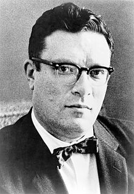

<table class="infobox vcard">
<tbody>
<tr>
<th colspan="2">

Isaac Asimov

</th>
</tr>
<tr>
<td colspan="2"></td>
</tr>
<tr>
<th scope="row">Native name</th>
<td>

<a title="Russian language" href="https://en.wikipedia.org/wiki/Russian_language">Russian</a>:&nbsp;Исаак Азимов

</td>
</tr>
<tr>
<th scope="row">Born</th>
<td>Isaak Azimov c.&thinsp; January 2, 1920<a href="https://en.wikipedia.org/wiki/Isaac_Asimov#cite_note-birthday-1">[a]</a> <a title="Petrovichi, Smolensk Oblast" href="https://en.wikipedia.org/wiki/Petrovichi,_Smolensk_Oblast">Petrovichi</a>,&nbsp;<a title="Smolensk Governorate" href="https://en.wikipedia.org/wiki/Smolensk_Governorate">Smolensk Governorate</a>,&nbsp;<a title="Russian Soviet Federative Socialist Republic" href="https://en.wikipedia.org/wiki/Russian_Soviet_Federative_Socialist_Republic">Russian SFSR</a></td>
</tr>
<tr>
<th scope="row">Died</th>
<td>April 6, 1992&nbsp;(aged&nbsp;72) <a title="Brooklyn" href="https://en.wikipedia.org/wiki/Brooklyn">Brooklyn</a>,&nbsp;<a title="New York City" href="https://en.wikipedia.org/wiki/New_York_City">New York City</a>, U.S.</td>
</tr>
<tr>
<th scope="row">Occupation</th>
<td class="role">Writer, professor of&nbsp;<a title="Biochemistry" href="https://en.wikipedia.org/wiki/Biochemistry">biochemistry</a></td>
</tr>
<tr>
<th scope="row">Nationality</th>
<td class="category">Soviet (early years), American</td>
</tr>
<tr>
<th scope="row">Education</th>
<td>

<ul>
<li><a title="Bachelor of Science" href="https://en.wikipedia.org/wiki/Bachelor_of_Science">Bachelor of Science</a>, 1939</li>
<li><a title="Master of Arts" href="https://en.wikipedia.org/wiki/Master_of_Arts">Master of Arts</a>, 1941</li>
<li><a title="Doctor of Philosophy" href="https://en.wikipedia.org/wiki/Doctor_of_Philosophy">Doctor of Philosophy</a>, 1948</li>
</ul>

</td>
</tr>
<tr>
<th scope="row">Alma&nbsp;mater</th>
<td><a title="Columbia University" href="https://en.wikipedia.org/wiki/Columbia_University">Columbia University</a></td>
</tr>
<tr>
<th scope="row">Genre</th>
<td class="category">Science fiction (<a title="Hard science fiction" href="https://en.wikipedia.org/wiki/Hard_science_fiction">Hard SF</a>,&nbsp;<a title="Social science fiction" href="https://en.wikipedia.org/wiki/Social_science_fiction">social SF</a>),&nbsp;<a title="Mystery fiction" href="https://en.wikipedia.org/wiki/Mystery_fiction">mystery</a>,&nbsp;<a title="Popular science" href="https://en.wikipedia.org/wiki/Popular_science">popular science</a></td>
</tr>
<tr>
<th scope="row">Subject</th>
<td><a title="Popular science" href="https://en.wikipedia.org/wiki/Popular_science">Popular science</a>, science&nbsp;<a class="mw-redirect" title="Textbooks" href="https://en.wikipedia.org/wiki/Textbooks">textbooks</a>, essays,&nbsp;<a title="History" href="https://en.wikipedia.org/wiki/History">history</a>,&nbsp;<a title="Literary criticism" href="https://en.wikipedia.org/wiki/Literary_criticism">literary criticism</a></td>
</tr>
<tr>
<th scope="row">Literary movement</th>
<td><a title="Golden Age of Science Fiction" href="https://en.wikipedia.org/wiki/Golden_Age_of_Science_Fiction">Golden Age of Science Fiction</a></td>
</tr>
<tr>
<th scope="row">Years&nbsp;active</th>
<td>1939&ndash;1992</td>
</tr>
<tr>
<th scope="row">Spouse</th>
<td>

<ul>
<li>

Gertrude Blugerman (<abbr title="married">m.</abbr>&nbsp;1942;&nbsp;<abbr title="divorced">div.</abbr>&nbsp;1973)

</li>
<li>

<a title="Janet Asimov" href="https://en.wikipedia.org/wiki/Janet_Asimov">Janet Opal Jeppson</a> (<abbr title="married">m.</abbr>&nbsp;1973)

</li>
</ul>

</td>
</tr>
<tr>
<th scope="row">Children</th>
<td>2</td>
</tr>
<tr>
<th scope="row">Relatives</th>
<td><a title="Eric Asimov" href="https://en.wikipedia.org/wiki/Eric_Asimov">Eric Asimov</a>&nbsp;(nephew)</td>
</tr>
<tr>
<td colspan="2">
</td>
</tr>
<tr>
<th scope="row">Signature</th>
<td></td>
</tr>
<tr>
<td colspan="2">&nbsp;</td>
</tr>
<tr>
<td colspan="2"><strong>Scientific career</strong></td>
</tr>
<tr>
<th scope="row">Fields</th>
<td class="category"><a title="Biochemistry" href="https://en.wikipedia.org/wiki/Biochemistry">Biochemistry</a></td>
</tr>
<tr>
<th scope="row">Institutions</th>
<td><a title="Boston University" href="https://en.wikipedia.org/wiki/Boston_University">Boston University</a></td>
</tr>
<tr>
<th scope="row"><a title="Thesis" href="https://en.wikipedia.org/wiki/Thesis">Thesis</a></th>
<td><a class="external text" href="http://www.worldcat.org/title/kinetics-of-the-reaction-inactivation-of-tyrosinase-during-its-catalysis-of-the-aerobic-oxidation-of-catechol/oclc/609476547" rel="nofollow"><em>The kinetics of the reaction inactivation of tyrosinase during its catalysis of the aerobic oxidation of catechol</em></a>&nbsp;(1948)</td>
</tr>
<tr>
<th scope="row"><a title="Doctoral advisor" href="https://en.wikipedia.org/wiki/Doctoral_advisor">Doctoral advisor</a></th>
<td>Charles Reginald Dawson</td>
</tr>
<tr>
<th scope="row">Other&nbsp;academic advisors</th>
<td><a title="Robert Elderfield" href="https://en.wikipedia.org/wiki/Robert_Elderfield">Robert Elderfield</a>&nbsp;<small>(<a title="Postdoctoral researcher" href="https://en.wikipedia.org/wiki/Postdoctoral_researcher">post-doctoral</a>)</small></td>
</tr>
</tbody>
</table>
 
<h2>Books </h2>
<ul>
  
 <li><a target="_blank" href="https://github.com/manjunath5496/Isaac-Asimov-Books/blob/master/sac(1).pdf" style="text-decoration:none;">Reason</a></li>
  
<li><a target="_blank" href="https://github.com/manjunath5496/Isaac-Asimov-Books/blob/master/sac(2).pdf" style="text-decoration:none;">The Best Of Isaac Asimov</a></li>

<li><a target="_blank" href="https://github.com/manjunath5496/Isaac-Asimov-Books/blob/master/sac(3).pdf" style="text-decoration:none;">Foundation and Earth</a></li>                         
  <li><a target="_blank" href="https://github.com/manjunath5496/Isaac-Asimov-Books/blob/master/sac(4).pdf" style="text-decoration:none;">The Gods Themselves</a></li>  
     <li><a target="_blank" href="https://github.com/manjunath5496/Isaac-Asimov-Books/blob/master/sac(5).pdf" style="text-decoration:none;">I, Robot</a></li>  
      <li><a target="_blank" href="https://github.com/manjunath5496/Isaac-Asimov-Books/blob/master/sac(6).pdf" style="text-decoration:none;">The Foundation Trilogy</a></li>  
  
  <li><a target="_blank" href="https://github.com/manjunath5496/Isaac-Asimov-Books/blob/master/sac(7).pdf" style="text-decoration:none;">The Collapsing Universe: The Story of Black Holes </a></li>  

<li><a target="_blank" href="https://github.com/manjunath5496/Isaac-Asimov-Books/blob/master/sac(8).rar" style="text-decoration:none;">Asimov's Guide to the Bible </a></li>  

 <li><a target="_blank" href="https://github.com/manjunath5496/Isaac-Asimov-Books/blob/master/sac(9).pdf" style="text-decoration:none;">The Bicentennial Man</a></li>  

<li><a target="_blank" href="https://github.com/manjunath5496/Isaac-Asimov-Books/blob/master/sac(10).pdf" style="text-decoration:none;"> All the Troubles of the World</a></li>  

 <li><a target="_blank" href="https://github.com/manjunath5496/Isaac-Asimov-Books/blob/master/sac(11).pdf" style="text-decoration:none;">Fantastic Voyage</a></li>
  
<li><a target="_blank" href="https://github.com/manjunath5496/Isaac-Asimov-Books/blob/master/sac(12).pdf" style="text-decoration:none;">Robot Visions</a></li>

<li><a target="_blank" href="https://github.com/manjunath5496/Isaac-Asimov-Books/blob/master/sac(13).pdf" style="text-decoration:none;">The Ugly Little Boy</a></li>                         
  <li><a target="_blank" href="https://github.com/manjunath5496/Isaac-Asimov-Books/blob/master/sac(14).pdf" style="text-decoration:none;">The Complete Robot</a></li>  
     <li><a target="_blank" href="https://github.com/manjunath5496/Isaac-Asimov-Books/blob/master/sac(15).pdf" style="text-decoration:none;">Foundation and Empire</a></li>  
  <li><a target="_blank" href="https://github.com/manjunath5496/Isaac-Asimov-Books/blob/master/sac(16).pdf" style="text-decoration:none;">Pebble in the Sky </a></li>  
  <li><a target="_blank" href="https://github.com/manjunath5496/Isaac-Asimov-Books/blob/master/sac(17).pdf" style="text-decoration:none;">Little Lost Robot</a></li>  

<li><a target="_blank" href="https://github.com/manjunath5496/Isaac-Asimov-Books/blob/master/sac(18).pdf" style="text-decoration:none;">Robots and Empire </a></li>  

  <li><a target="_blank" href="https://github.com/manjunath5496/Isaac-Asimov-Books/blob/master/sac(19).pdf" style="text-decoration:none;">Second Foundation</a></li>  
     <li><a target="_blank" href="https://github.com/manjunath5496/Isaac-Asimov-Books/blob/master/sac(20).pdf" style="text-decoration:none;">Tales of the Black Widowers</a></li>  
 
  <li><a target="_blank" href="https://github.com/manjunath5496/Isaac-Asimov-Books/blob/master/sac(21).pdf" style="text-decoration:none;">The Caves of Steel</a></li>  

<li><a target="_blank" href="https://github.com/manjunath5496/Isaac-Asimov-Books/blob/master/sac(22).pdf" style="text-decoration:none;">The Currents of Space</a></li>  

 <li><a target="_blank" href="https://github.com/manjunath5496/Isaac-Asimov-Books/blob/master/sac(23).pdf" style="text-decoration:none;">The End of Eternity</a></li>  

<li><a target="_blank" href="https://github.com/manjunath5496/Isaac-Asimov-Books/blob/master/sac(24).pdf" style="text-decoration:none;">The Positronic Man </a></li>  

  <li><a target="_blank" href="https://github.com/manjunath5496/Isaac-Asimov-Books/blob/master/sac(25).pdf" style="text-decoration:none;">The Rest of the Robots</a></li>  

<li><a target="_blank" href="https://github.com/manjunath5496/Isaac-Asimov-Books/blob/master/sac(26).pdf" style="text-decoration:none;">The Robots of Dawn</a></li>  

 <li><a target="_blank" href="https://github.com/manjunath5496/Isaac-Asimov-Books/blob/master/sac(27).pdf" style="text-decoration:none;">The Stars, Like Dust</a></li>  

<li><a target="_blank" href="https://github.com/manjunath5496/Isaac-Asimov-Books/blob/master/sac(28).pdf" style="text-decoration:none;">Forward the Foundation</a></li>  

  <li><a target="_blank" href="https://github.com/manjunath5496/Isaac-Asimov-Books/blob/master/sac(29).pdf" style="text-decoration:none;">Foundation's Edge</a></li>  

<li><a target="_blank" href="https://github.com/manjunath5496/Isaac-Asimov-Books/blob/master/sac(30).pdf" style="text-decoration:none;">Nightfall</a></li>  

 <li><a target="_blank" href="https://github.com/manjunath5496/Isaac-Asimov-Books/blob/master/sac(31).pdf" style="text-decoration:none;">Profession</a></li>  

<li><a target="_blank" href="https://github.com/manjunath5496/Isaac-Asimov-Books/blob/master/sac(32).pdf" style="text-decoration:none;">Robot Dreams</a></li>  

<li><a target="_blank" href="https://github.com/manjunath5496/Isaac-Asimov-Books/blob/master/sac(33).pdf" style="text-decoration:none;">The Last Question</a></li>

<li><a target="_blank" href="https://github.com/manjunath5496/Isaac-Asimov-Books/blob/master/sac(34).pdf" style="text-decoration:none;">True Love</a></li>  

 <li><a target="_blank" href="https://github.com/manjunath5496/Isaac-Asimov-Books/blob/master/sac(35).pdf" style="text-decoration:none;">Nine Tomorrows</a></li>  

</ul>
